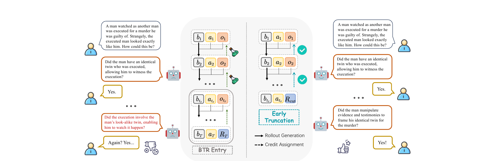
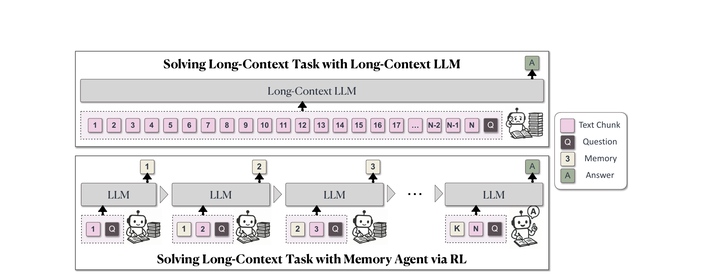
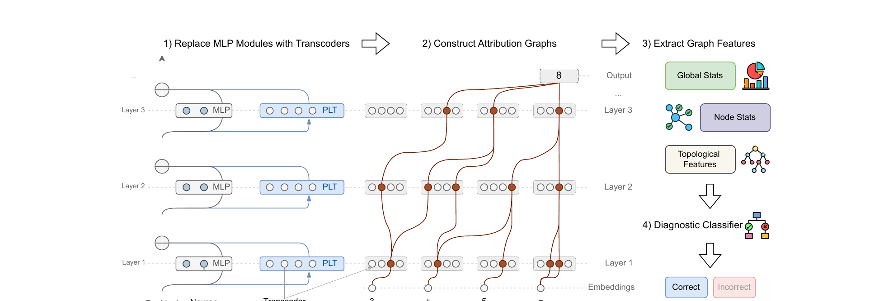
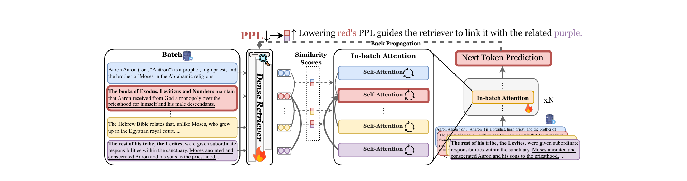
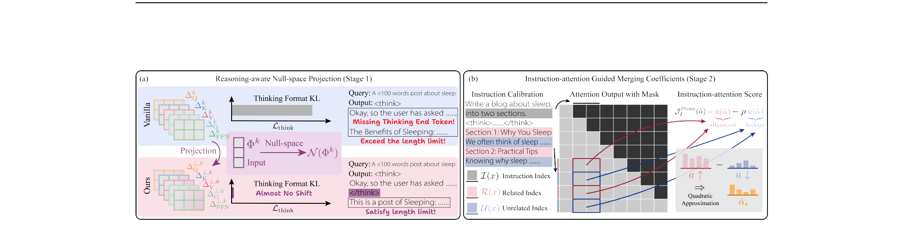

The first oral session on Day 1 of ICLR 2026 was LLMs and Reasoning. Five talks back to back. What follows is my set of notes from the session.

## Reducing Belief Deviation in RL for Active Reasoning of LLM Agents

Zou et al. open with a failure mode everyone who has trained an LLM agent has seen: endless wrong debugging loops, repeated failed actions, the agent politely continuing to dig. The authors formalize active reasoning as a POMDP and show *why* the digging happens, not just that it does.

The agent maintains an internal belief $b_t$ over the latent task state. Their Assumption 1 is that LLMs are weak belief trackers: in high-uncertainty regimes, the belief-update error grows with the belief-deviation itself. Cross a threshold $U$ on the truth-anchored potential $\Psi(b) = -\log b(s^*)$ and you enter what they call the **Belief Trap Region (BTR)**: an absorbing set where expected progress is non-positive.

The theoretical punchline is Theorem 2. A sufficiently long uninformative tail does not just add noise to the RL gradient. It *inverts* the expected advantage for the informative actions that preceded the trap. The pre-BTR exploratory behavior, the part that was actually working, gets a negative credit signal and is trained *against*. That is the reason T3 works.

*Figure 1 from Zou et al., ICLR 2026 (arXiv:2510.12264). Left, a vanilla rollout slides into the Belief Trap Region and gets penalized for its informative prefix. Right, T3 truncates at BTR entry so credit lands where it belongs.*

The fix, **Truncating Belief-Trapped Trajectories (T3)**, cuts the trajectory at BTR entry so credit stays on the informative prefix. Since exact BTR onset is unobservable, they use a proxy: detect when the hypothesis space stops contracting for $k$ consecutive steps. Proposition 1 bounds the false-truncation probability with exponential decay in $k$. Per-task instantiations: set contraction for GuessNumbers and CircuitDecoding, judge feedback for SituationPuzzles, cosine-similarity change for preference tasks. The method drops in around PPO, GRPO, or GSPO without touching the optimizer.

Results from the paper: +30.1 EM on GuessNumbers with GRPO, +41.0 EM on MovieRecommendation with GSPO, up to 34% fewer rollout tokens. 3B models barely benefit, 7B and 14B clearly do, and DeepSeek-R1 distillates benefit more than vanilla Llama-8B. The scaling pattern is consistent with the theory: better baseline belief tracking amplifies T3's utility.

Full paper: [arXiv:2510.12264](https://arxiv.org/abs/2510.12264).

## MemAgent: Reshaping Long-Context LLMs with Multi-Conv RL Based Memory

Yu et al. had the cleanest framing of the session. Long-context LLMs face what they called the **impossible trinity**: ultra-long input, linear complexity, lossless extrapolation. Pick two.

Their question was whether you can *train* a memory management process rather than hard-code it into the architecture. Three design commitments: train the model to learn memory, store memory as fixed-length text so complexity stays constant, optimize end to end with no hand-designed patterns.

*Figure 2 from Yu et al., ICLR 2026 (arXiv:2507.02259). MemAgent reads a document as a stream of chunks, rewriting a fixed-length memory between each step, then answers from the final memory only.*

The workflow splits into a context-processing module that reads each chunk $c^k$ together with the previous memory $m^{k-1}$ and emits a new fixed-length memory $m^k$, and an answer-generation module that sees only the final memory $m^K$. In their implementation: 1024-token memory, 5000-token chunks, 1024 tokens for query and output, all fitting in an 8K context window. Section 3.4 of the paper reframes this as a recurrent factorization of the autoregressive likelihood, so the transformer effectively becomes a recurrent network whose state size is a hyperparameter.

Training is **Multi-Conv DAPO**, an extension of DAPO that treats each chunk-reading pass as an independent conversation and distributes the outcome reward from the final answer back across all memory-update turns. The RL signal is what teaches the model to keep answer-relevant facts and drop distractors.

Evaluation is on **RULER across 10 tasks** (NIAH variants, Variable Tracking, Frequent Words Extraction), plus RULER-QA derived from SQuAD, at context lengths from 7K to 3.5M tokens. On RULER-HotpotQA, RL-MemAgent-14B goes from 83.59 at 7K to 78.12 at 3.5M, under 5% degradation across 500x length scaling. QwenLong-L1-32B, the largest baseline, collapses from 72.66 to 11.72 before hitting 1M tokens. MemAgent-7B overtakes the 32B baseline from 112K onward. The without-RL ablation degrades after 112K, so the RL component is doing real work, not just the data.

Fun fact from the Q&A: the presenter is 21, interns at ByteDance, plays piano, likes anime.

Full paper: [arXiv:2507.02259](https://arxiv.org/abs/2507.02259).

## Verifying CoT Reasoning via its Computational Graph

Zhao et al. start from a classical-software analogy. Deep networks implement algorithms, usually different from what a human would write, and often different from what the model claims when asked. Standard evaluation tells you a reasoning step was wrong. It does not tell you why. In classical software you would read the execution trace. Their question: can **attribution graphs** play that role for CoT?

Their hypothesis is that reasoning failures leave structural marks in attribution graphs. **Circuit-Based Reasoning Verification (CRV)** is the four-stage pipeline that operationalizes it.

*Figure 1 from Zhao et al., ICLR 2026 (arXiv:2510.09312). Four stages: swap MLPs for transcoders, build an attribution graph per CoT step, extract graph features, and classify correctness.*

1. Replace each MLP with a **transcoder** (Dunefsky et al., 2025): an autoencoder-style functional substitute with TopK sparsity that decomposes the MLP computation into interpretable sparse features. The authors trained per-layer transcoders for Llama 3.1 8B Instruct on 10B tokens of RedPajama-V2, latent dimension 131,072.
2. For each CoT step, construct a sparse directed attribution graph backward from the final logits using the greedy path-finding algorithm of Dunefsky et al. (2025), with the implementation from Hanna et al. (2025) (the `safety-research/circuit-tracer` library).
3. Extract a fixed feature vector across three families: global statistics, node influence and activation statistics, topological and path-based features.
4. Train a gradient-boosted classifier on those features to predict step correctness.

On synthetic arithmetic, CRV hits AUROC 92.47 against the best baseline's 76.45 (Energy), and FPR@95 of 37% against 63%. Boolean and GSM8K show the same ranking with smaller absolute margins. Leave-one-out ablation says node-influence features matter most, topological features least. Cross-domain transfer is poor: a classifier trained on arithmetic and tested on boolean lands at AUROC 69.59, and trained on arithmetic then tested on GSM8K it falls to 57.04, below the Energy baseline. Different reasoning domains fail with structurally different fingerprints.

The striking result is causal. On the expression `7 * ((5+9) + 7)`, the model incorrectly computes `7 * 14 = 98`. CRV flags the step and traces it to transcoder feature 91814, a late-layer feature associated with multiplication. Zeroing that single feature's activation via a forward hook causes the model to generate `14 + 7 = 21` and reach the correct final answer. A complementary experiment corrects an error by amplifying an under-active feature. That is a working demonstration of targeted model repair, not just detection.

Full paper: [arXiv:2510.09312](https://arxiv.org/abs/2510.09312). Code: [facebookresearch/CRV](https://github.com/facebookresearch/CRV).

## Revela: Dense Retriever Learning via Language Modeling

Cai et al. attack the annotation bottleneck in dense retrieval. The dominant recipe, contrastive learning, needs annotated query-document pairs, hard-negative mining, and quality control. Expensive, slow, especially painful in domains like law or code. Self-supervised alternatives like Contriever rely on structural heuristics (inverse cloze task, independent cropping) that introduce biases. Distillation approaches like REPLUG align a trainable retriever to a frozen LM's perplexity, but as Geng et al. (2024) showed, a frozen LM's perplexity is poorly calibrated for retrieval.

Revela's move is to make the retriever a first-class participant in next-token prediction and let NTP train it.

*Figure 1 from Cai et al., ICLR 2026 (arXiv:2506.16552). A batch of raw chunks goes through a dense retriever, whose similarity scores reweight the in-batch attention inside the LM. A single next-token loss backpropagates into both.*

The framework:

1. Input a batch of raw chunks.
2. The retriever encodes each chunk and computes pairwise cosine similarities with temperature-softmax normalization.
3. Each transformer block is augmented with an **in-batch attention** path: alongside the standard causal self-attention, each token also attends to the cached keys and values of every other document in the batch, with the cross-document contributions aggregated using retriever similarity $\text{Sim}(D_i, D_j)$ as weights.
4. A single next-token-prediction loss backpropagates into both the LM and the retriever jointly.

No pairs, no hard-negative mining, no distillation step.

The numbers carry the talk. On CoIR, Revela-3B hits mean nDCG@10 of 60.1 against E5-Mistral-7B-Instruct at 57.3, Voyage-2 at 56.3, OpenAI Ada-2 at 45.6. On BRIGHT, 20.1 against E5-Mistral's 17.9 and commercial APIs at 17.9. On BEIR, Revela-3B matches E5-PT's 45.6 with roughly 1000x less training data and 10x fewer compute hours. The three scaling axes (retriever size, LM size, batch size) all give gains, with LM size mattering more for specialized domains.

Full paper: [arXiv:2506.16552](https://arxiv.org/abs/2506.16552). Code and checkpoints: [TRUMANCFY/Revela](https://github.com/TRUMANCFY/Revela).

## RAIN-Merging: A Gradient-Free Method to Enhance Instruction Following

Huang et al. address a specific pain point in deploying reasoning models. Large reasoning models like DeepSeek-R1 distillates produce elaborate `<think>...</think>` traces but routinely ignore output format and constraint instructions. Continual SFT and RL both fix it at high cost. Can model merging do it cheaper?

They work with **task vectors**, the parameter difference $\Delta_I = \theta_I - \theta_B$ between a base model and its instruction-tuned version, and likewise $\Delta_R$ for the reasoning model. Two observations motivate the method. First, per-module SVD of $\Delta_R$ and $\Delta_I$ yields principal subspaces that are **nearly orthogonal**, with cosine similarity below 0.1 across all layers and modules (Figure 2 in the paper). Second, direct task-vector addition breaks the thinking format, with 6.4% of generations missing the `</think>` token.

*Figure 3 from Huang et al., ICLR 2026 (arXiv:2602.22538). Stage 1 (left) null-space projection preserves the thinking format. Stage 2 (right) uses instruction-attention alignment and a quadratic approximation for per-module coefficients.*

**Stage 1, Reasoning-aware Null-space Projection.** For each submodule $k$, they build the orthogonal projector onto the null space of the thinking-token forward features $\Phi^k_{\Omega_\text{think}}$ and project the ITM task vector into it. By construction the forward features at `<think>` and `</think>` positions are unchanged, so the thinking format is preserved. Proposition 1 bounds the KL divergence on thinking-token output distributions by $O(\|\Delta_I^\perp\|_2^2) \approx 0$.

**Stage 2, Instruction-attention Guided Merging Coefficients.** Stage 1 preserves format but does not yet boost instruction following. Stage 2 scales the projected vector per-module. They define an **instruction-attention score**: for each attention head, alignment is the normalized attention mass from response tokens to instruction tokens, leakage is the mass going to unrelated tokens. The proxy objective is $\bar{a}(\bar{\alpha}) - \rho \bar{u}(\bar{\alpha})$. A **quadratic approximation** around the direct-merge point gives a closed-form per-head coefficient $\alpha_\star^{\bar{k}} = \text{clip}(g^{\bar{k}} / \tilde{H}^{\bar{k}})$, with the Hessian approximated diagonally as $\text{diag}(1) + \mathbb{E}[u^{\bar{k}}]$ so heads with high leakage are penalized more. FFN modules use layer-averaged coefficients.

Stage 2 does most of the instruction-following lift. The ablation shows Stage 1 alone at 46.58 IF average, Stage 2 alone at 47.62, and full RAIN-Merging at 48.11. The whole pipeline runs in about 21 minutes on a 7B model with roughly 500 calibration examples, compared to 120 minutes for SFT, and memory stays at 22 GB against SFT's 112 GB. The striking side effect is that merging improves reasoning above the unmerged LRM (55.59 vs 51.03), which the authors attribute to tighter instruction adherence producing cleaner internal chains.

Full paper: [arXiv:2602.22538](https://arxiv.org/abs/2602.22538). Code: [Klnght/RAIN-Merging](https://github.com/Klnght/RAIN-Merging).
