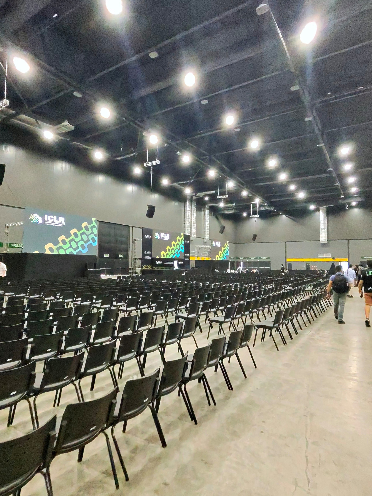
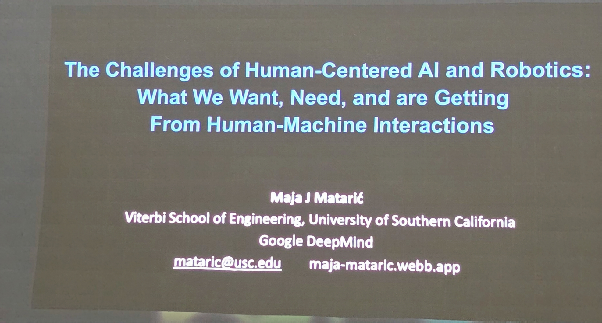
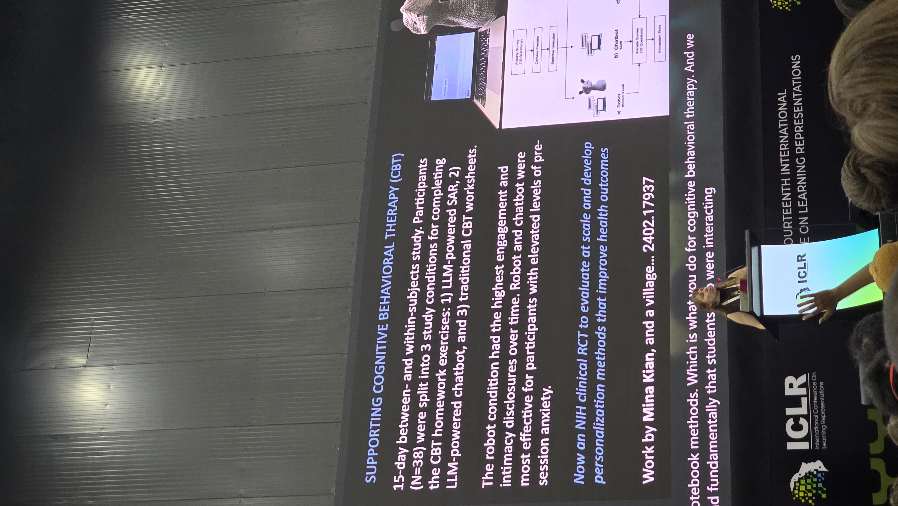

*The main hall half an hour before doors. You can tell a conference is serious about a talk when they start setting up the overflow seating before breakfast.*

I got to the room early on purpose. The opening keynote at ICLR 2026 was Maja Mataric — USC Viterbi and Google DeepMind, one of the people who essentially built the field of socially assistive robotics. The title was a mouthful: *"The Challenges of Human-Centered AI and Robotics: What We Want, Need, and Are Getting From Human-Machine Interactions."* The talk itself wasn't.

What follows is my set of notes on her keynote, plus some thoughts.

## The question she opened with

Mataric opened with something that sounds almost too simple to ask at a venue like ICLR: *why do we work on AI?*

She gave two honest answers. One is intellectual curiosity, the discovery drive. The other is the "greater good" — human-centered technologies that help people. 

That framing shaped everything that came after.

*Title slide. USC Viterbi and Google DeepMind.*

## Intelligence evolved inside a body. Ours didn't come from text.

Human intelligence, she reminded us, evolved inside a **body** and an **environment**. Language and complex reasoning weren't bootstrapped from a giant pile of tokens, they emerged from social interaction, from needing to coordinate with other embodied agents who had their own goals and their own bodies. Our cognition is, top to bottom, shaped by the fact that we have hands and faces and skin and other people.

AI, she pointed out, has none of that.

The provocation: *how general can AGI actually get without a body to reach the world?* If social and physical interaction were the pressure that produced the kind of intelligence we're trying to replicate, can we really skip them? Can we collect the data we'd need from multimodal social interaction without ever touching the physical world?

She wasn't arguing that language models are useless. She was arguing that "general" might be the wrong word for what a disembodied system can ever be.

## The machines people will actually accept

A slide simply asked: *how do we create machines that people will accept?*

The answer is nobody knows. But we'd better start thinking about it, because embodied AI is already showing up among us, and the human response is messier than the research papers let on.

Life-like behavior, she said, triggers two things at the same time:

- **Helpfulness, empathy, relatedness** on one side.
- **Creepiness, cognitive dissonance, and outright bullying or abuse** on the other.

The design question then probably "how do we design for the full, ugly range of how people actually behave around things that seem alive?"

## Socially assistive robots, and the gap between knowing and doing

From there the talk narrowed into her core research area: **Socially Assistive Robotics (SAR)**, machines that help people help themselves through social interaction, with measurable outcomes.

She led into it with a sentence I wrote down verbatim: *we know what we should do, but we don't do it.* Exercise, therapy, language practice, rehabilitation, taking the medication. 

Her argument was that the standard toolkit can't close that gap on its own:

- **Perception** — quantified-self monitoring, detection, diagnosis, prevention. Insufficient, because information alone doesn't change behavior.
- **Action** — coaching and training. Insufficient, because one-on-one coaches don't scale.
- **Socio-emotional support** — companionship. Necessary, and the piece almost nothing in tech is actually shipping.

An SAR system, in her framing, needs all three at once. Real-time vision for user detection, affect, gesture, pose, and activity. Speech-to-speech models. Personalized perception for high-level features like engagement and atypical affect. A fine-tuned LLM for dialogue that carries domain and context knowledge — she used CBT as the running example. A physically embodied behavior layer with primitives like gestures, facial expressions, and body poses. And adaptation to the individual user, usually via reinforcement learning.

That is a stack. It is also, importantly, not a chatbot.

*The CBT study (Mina Kian et al., arXiv 2402.17937).

## Why the body keeps mattering

One of the strongest moments of the talk was when she put up a meta-analysis of embodiment studies. The summary, delivered flatly: **embodied interactions lead to better learning, training, and health outcomes than non-embodied ones.** Not a little better. Consistently better, across studies, across domains.

She showed a clip of babies mirroring a physical robot, the kind of imitation behavior you see between infants and other humans. The same clip on a screen doesn't produce it. The body isn't decoration, but rather what the social brain is actually reaching for.

Which led her to a question that's going to be controversial for a certain slice of the industry: *what is the right embodiment?*

Her answer, again blunt: **humanoids aren't it.** The more human-shaped you make a robot, the more people expect of it, and the harder it crashes when it fails to meet those expectations. Humanoid form induces disappointment almost by construction. The right embodiment for an assistive robot is the one that sets the right expectations, not the one that looks the most like us.

## Personality, empathy, and where foundation models come up short

She spent a stretch of the talk on a set of questions most of us don't think of as core ML problems:

- **Can we model personality?** Yes, to a degree — personality shows up in measurable things like voice and gesture. Her group initializes robots with a Big Five profile and then adapts personality to the user over time.
- **Do LLMs have personality?** Kind of. They display one. Whether it's stable, reliable, or validly measured is open. Whether it varies with model size, or between Q&A, dialogue, and long-form generation, is also open. She cited recent work prompting LLMs with personality traits to see if they reproduce human personality-driven differences in dispute resolution. They partly do — but with a twist. For humans, **neuroticism** was the best predictor of final outcome. For LLMs, it was **extraversion and agreeableness**. Not the same machine underneath.
- **Can we model empathy?** Partially. Two findings stuck: vulnerability from the robot significantly sustained users' willingness to help it, and prior familiarity with robots was a significant predictor of sustained empathy over time.

Then a slide that I suspect will get quoted a lot: *foundation models can't understand affect.* Supervised models, trained specifically for the task, still consistently outperform foundation models on intent recognition, facial expression, and related affective signals. The generalist doesn't beat the specialist where the specialist has been measured carefully.

## The ending she chose

She closed on one line, and I'll end on it too: *let's think about enhancing, rather than replacing.*