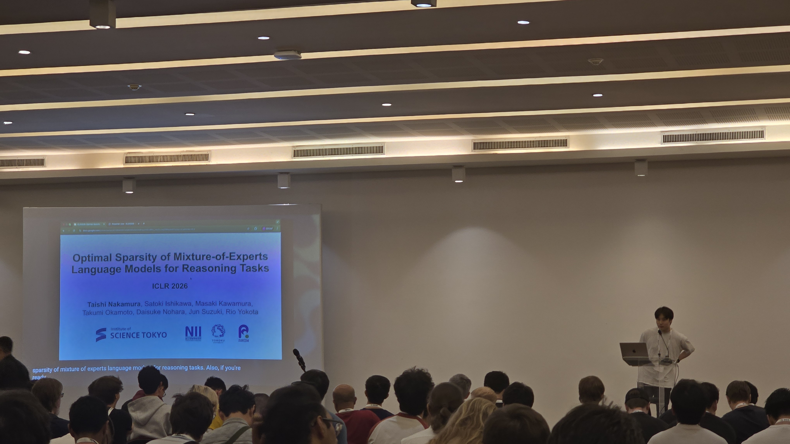

Day 2 of ICLR 2026 opened with the first oral session on ML Architectures and Training. Five talks back to back, all about how we actually train these things. What follows is my set of notes from the session.

*Day 2 at ICLR 2026. Oral Session on ML Architectures and Training I opens with Taishi Nakamura presenting Optimal Sparsity of MoE for Reasoning Tasks.*

## WSM: Decay-Free Learning Rate via Checkpoint Merging

Tian et al. open with the limitation of cosine LR: if you want to change the decay curve, you restart. Warmup-Stable-Decay (WSD) improved flexibility by separating stable and decay phases, but it still asks the practitioner to decide three things up front: when to begin decay, how long to decay for, and which curve to use.

WSM (Warmup-Stable and Merge) drops the decay phase entirely. Keep LR constant forever, save checkpoints on a regular interval, and merge them after the fact to emulate whatever decay shape you want.

*Figure 1 from Tian et al., ICLR 2026. Cosine LRS requires a full restart to change the decay curve. WSD inserts a stable phase but still commits you to a decay shape up front. WSM keeps LR constant and emulates decay after the fact by merging checkpoints.*

The theoretical backbone is Theorem 3.1. Each checkpoint can be written as the initial state plus accumulated gradient updates, $\theta_{n+k} = \theta_n - \eta \sum_{i=1}^{k} g_{n+i-1}$. A weighted average of checkpoints with weights $\{c_j\}$ produces an effective per-gradient decay coefficient $w_i = \sum_{j=i}^{k} c_j$. The theorem inverts the map: for any target monotonically-decreasing $\{w_i\}$, the merge weights are unique, $c_k = w_k$ and $c_j = w_j - w_{j+1}$ for $j \in [1, k-1]$. Cosine, linear, inverse-sqrt all drop out as special cases.

On 16.3B-parameter MoE pre-training (1.43B active, 10.2T tokens), WSM beats WSD across every category: +2.30% on Mathematics, +4.83% on Professional Knowledge, +2.04% overall average, with headline benchmark gains of +3.5% on MATH, +2.9% on HumanEval, +5.5% on MMLU-Pro. Merge duration is the dominant hyperparameter. Checkpoint interval and count matter less. Mean averaging beats EMA. A theoretically-derived $1-\sqrt{\cdot}$ weighting beats mean averaging marginally.

A side result worth noting: WSM gives better MoE load balancing than WSD, with mean global max expert-utilization violations dropping from 0.601 to 0.545. The ablation on hybrid approaches (merge-then-decay, decay-then-merge) finds no improvement over either alone, which the authors read as evidence the two methods solve the same underlying optimization problem.

Full paper: [arXiv:2507.17634](https://arxiv.org/abs/2507.17634).

## Optimal Sparsity of MoE for Reasoning Tasks

Nakamura et al. ask a sharp question: under a fixed compute budget, what MoE sparsity optimizes reasoning, and does it match the sparsity that optimizes pre-training loss? The answer is no, and the gap between the two is large enough to matter.

They sweep model width $d \in \{512, 1024, 2048\}$, experts per layer $E \in \{8, 16, 32, 64, 128, 256\}$, and top-$k$ routing $k \in \{2, 4, 8, 16\}$, training on a fixed 125B-token Chinchilla-optimal corpus. Sparsity is $s = 1 - k/E$.

The first finding is that validation loss is not a reliable proxy for reasoning. Cross-entropy decreases monotonically with total parameters, but downstream task loss for GSM8K and GSM-Plus traces an inverted-U as a function of sparsity. Memorization tasks (TriviaQA, HellaSwag) behave as expected and improve monotonically with lower loss. Reasoning does not.

*Same training loss, different reasoning performance. At fixed cross-entropy, denser MoE configurations (lower sparsity) do better on GSM8K and GSM-Plus. TriviaQA and HellaSwag collapse onto a single curve. Validation loss is not the right yardstick for reasoning.*

The relationship is non-monotonic in a load-bearing way. Lower loss can actively predict worse reasoning at high sparsity: models with $E=8$, top-$k=2$ reach ~70-75% accuracy on GSM8K, while equivalent-loss models with $E=32$, top-$k=2$ drop to ~60-65% despite having lower pre-training loss.

The second finding is that **active FLOPs**, not total parameters, are what reasoning needs. At iso-loss, models with larger top-$k$ (more active experts per token) consistently score higher on reasoning. Memorization's parameter-hunger does not transfer.

The third is a tokens-per-parameter story. Memorization improves monotonically as TPP decreases (more parameters per token always helps recall). Reasoning peaks near TPP ≈ 20 (the Chinchilla point) and degrades on either side.

The fourth is the one I found hardest to sit with. Test-time compute scaling with self-consistency up to $2^7 = 128$ samples and GRPO post-training both improve absolute accuracy across the board, but neither closes the sparsity gap. Relative ranking is preserved. The sparsity choice locked in during pre-training sets a ceiling that post-training at the compute scales studied cannot raise. Same pattern on MATH 500.

Full paper: [arXiv:2508.18672](https://arxiv.org/abs/2508.18672). Code: [rioyokotalab/optimal-sparsity](https://github.com/rioyokotalab/optimal-sparsity).

## How Learning Rate Decay Wastes Your Best Data (CDMA)

Luo et al. reframe a longstanding negative result. Data curriculum, sorting samples in ascending order of quality score, has been repeatedly reported to give weak or even negative gains in LLM pre-training. The dominant explanation has been that the quality scores are bad. Luo et al. show the actual failure mode is a scheduling mismatch: standard LR decay gives the most learning to the least-trustworthy data and the least to the best.

*Kairong Luo (Tsinghua / Peng Cheng Lab) presenting. The subtitle on the slide states the thesis: data curriculum is useful, but strong LR decay wastes the high-quality data.*

The mechanism is straightforward. Parameter updates are $\theta_{t+1} = \theta_t - \eta_t g_t$. Under ascending-quality curriculum and aggressive decay, early training gets a high $\eta_t$ on low-quality, noisy data, and late training gets a small $\eta_t$ on high-quality, high-signal-to-noise data. The schedule directly inverts the intent of the curriculum. Their controlled ablation confirms it: under constant LR, ascending-order curriculum substantially beats uniform shuffling; under WSD or cosine, the gap shrinks with more aggressive decay and disappears entirely at very small ending LRs.

Two fixes follow.

**CMA (Curriculum Model Averaging).** Keep LR constant throughout and take an EMA over the last $M$ checkpoints. EMA with non-decreasing weights toward recent checkpoints is preferred, since the last checkpoints have seen the best data. On DCLM-Baseline with Qwen2.5-1.5B and 30B tokens, CMA hits 50.95 average score vs 50.56 for WSD + Uniform.

**CDMA (Curriculum Decay Model Averaging).** Use *moderate* LR decay, ending at $\sim 10^{-3}$ (about 1/3 of peak LR of $3 \times 10^{-3}$), combined with EMA averaging. The optimal ending LR for curriculum is 100x less aggressive than the standard $10^{-5}$. Combining moderate decay + EMA + ascending curriculum yields +1.64-1.68% average improvement on core benchmarks.

Section 6 backs it with theory. Under ascending data + constant LR + SMA, they prove $\mathbb{E}[L(\bar{w}_M)] = \tilde{O}(M^{-2/3} L^2)$, beating the $\Theta(L^2)$ rate that aggressive WSD decay achieves in the curriculum setting.

In the mid-training scenario (high-quality data concentrated in the tail), gains are larger: +2.29% core benchmark improvement over baseline. On the WebOrganizer dataset, CMA gives +1.87%. PreSelect quality scores produce smaller gains than DCLM fasttext scores, so the method still depends on the quality metric tracking the target distribution.

Full paper: [arXiv:2511.18903](https://arxiv.org/abs/2511.18903).

## Softmax Transformers are Turing-Complete

Jiang, Hahn, Zetzsche and Lin close a theoretical gap that has been open since Pérez et al. (ICLR 2021) proved Turing-completeness for *hard-attention* transformers with CoT. Hard attention is not what practitioners use and carries no learnability guarantee. The question of whether softmax CoT transformers are Turing-complete has been open until now.

*TL;DR from Jiang, Hahn, Zetzsche and Lin. Theorem (informal): length-generalizable softmax CoT transformers are Turing-complete. Experimental result: the construction is validated by training transformers to recognize non-trivial arithmetic languages including primes, exponentials, division, GCD and multiplication.*

The formal model is SMAT (Softmax Transformer), a length-preserving causal LM with attention weights

$$\bar{w} = \text{softmax}\!\left(\log n \cdot \{v_j^\top \mathbf{K}^\top \mathbf{Q} v_i\}_{j=1}^{i}\right).$$

The $\log n$ scaling is doing real work. It prevents softmax from going uniform at large context lengths and enables sharp threshold-like behavior. The corresponding declarative language is **C-RASP** (Counting RASP), extended with a CoT token set $\Gamma$ so the model autoregressively writes intermediate steps before emitting an accept/reject token.

The proof strategy avoids direct Turing machine simulation. Instead, the authors route through **Minsky counter machines**, equivalent in power to Turing machines (Greibach, 1976) but whose increment, decrement and test-zero operations map naturally onto C-RASP counting primitives. Counter machine operations match softmax counting; Turing tape manipulation does not.

Two completeness tiers:

- Without RPE, CoT softmax transformers are Turing-complete over unary alphabets and letter-bounded languages of the form $a_1^* a_2^* \cdots a_n^*$.
- With additive Relative Positional Encodings $\mathfrak{R}$, they are Turing-complete over arbitrary alphabets.

A negative result gives the tier structure teeth. Without RPE over general alphabets, CoT C-RASP is *not* Turing-complete, because limit transformers have logarithmic communication complexity (Huang et al., 2025), so languages like palindromes are unreachable.

The empirical validation is uncomfortably clean for a theory paper. On length-generalization splits (train on $[1, 100]$, test on $[101, 200]$ and $[201, 300]$) for Primes, Exponentials, Division, GCD and Multiplication:

| Setting | test_0 | test_1 | test_2 |
|---|---|---|---|
| Unary, no RPE | >99.9% | >99.9% | >99.7% |
| Binary, with RPE | 100% | 100% | 100% |
| Binary, without RPE | 64-95% | 0-0.4% | 0.0% |

The binary-without-RPE condition collapses exactly where the theory predicts it should.

Full paper: [arXiv:2511.20038](https://arxiv.org/abs/2511.20038).

## Pre-training Under Infinite Compute

Kim, Kotha, Liang and Hashimoto open with the axis the field has been avoiding. Web text grows at ~1.03x per year while compute grows at ~4x. The compute-optimal Chinchilla framing assumes data is abundant, which is a short-lived assumption. They flip the problem: given a fixed dataset and unlimited compute, what is the best achievable loss, and how do you get there?

At 200M fixed tokens (already 140x overparameterized vs Chinchilla), they run standard pre-training recipes and watch them fail. Scaling epochs causes the loss to decrease then increase; the unregularized baseline overfits. Scaling parameters from 150M to 1.4B yields less than 0.1 loss improvement and eventually regresses.

![Line plot titled 'Comparing scaling recipes with no compute constraints'. X-axis is total parameter count from 150M to 1.4B, left Y-axis is DCLM validation loss from 3.2 to 3.8, right Y-axis is data efficiency multiplier. Four series: Standard recipe (red, roughly flat at 3.75-3.85), Regularized recipe (purple dashed, declines from 3.75 to asymptote at 3.43, 2.29x), Ensembling recipe (teal dashed, declines to asymptote at 3.34, 3.03x), Joint scaling recipe asymptote (orange dotted line at 3.17, 5.17x).](./iclr-2026-ml-architectures-orals/infinite-compute-scaling-recipes.png)
*Figure 1 from Kim, Kotha, Liang and Hashimoto, ICLR 2026. At 200M fixed tokens, the standard recipe (red) plateaus. The regularized recipe follows a clean $N^{-1.02}$ power law to asymptote 3.43. Ensembling drops the asymptote further. Joint scaling reaches 3.17, a 5.17x data-efficiency improvement.*

Two moves produce the headline result.

First, **regularized parameter scaling**. The optimal weight decay in the data-constrained regime is dramatically larger than standard: up to 3.2 at 1.4B parameters, vs the conventional 0.1. A 30x increase. With per-size-tuned weight decay (0.8 at 150M, 1.6 at 300M, 3.2 at 600M and 1.4B), parameter scaling follows

$$\hat{\mathcal{L}}_{200\text{M}, N} = \frac{0.05}{N^{1.02}} + 3.43.$$

Exponent 1.02 vs Chinchilla's 0.34. Asymptote 3.43. The monotonic power-law decrease holds specifically for the regularized recipe. The unregularized baseline overfits with more epochs and does not follow this law.

Second, **ensemble scaling**. $K$ independently trained models combined via logit averaging, $\text{LogitAvg}(M_i)(x) \propto \exp(\frac{1}{K} \sum_i \log M_i(x))$. Loss scales with exponent $\propto 1/K$, and the ensemble asymptote (300M models, $K \to \infty$) is 3.34, below the single-regularized asymptote of 3.43. Training two 300M models beats training one 600M model on the same token budget. When hyperparameters are re-tuned specifically for the $K \to \infty$ asymptote (2x epochs, 0.5x weight decay vs single-model optimum), the ensemble asymptote drops to 3.27.

Composing the two, $\lim_{N \to \infty} \lim_{K \to \infty} \min_H \mathcal{L}$, yields an asymptote of 3.17 at 200M tokens, a **5.17x data efficiency improvement** over the unregularized baseline.

| Recipe | Asymptote | Data efficiency |
|---|---|---|
| Standard (unregularized) | N/A | 1x |
| Regularized, single model | 3.43 | 2.29x |
| Ensemble + ensemble-tuned HPs | 3.27 | ~3.5x |
| Joint (parameter + ensemble) | 3.17 | **5.17x** |

Distillation partially reclaims the ensemble's inference cost. Distilling an 8x300M teacher (loss 3.32) into a single 300M student reaches loss 3.36, retaining 83% of the ensemble benefit at 8x lower inference cost. On continued pre-training for math (Llama 3.2 3B + MegaMath), an 8-model ensemble on 4B tokens beats the default recipe on 73B tokens: 17.5x data efficiency in the CPT setting.

The takeaway Kim closed with, which I wrote down verbatim: *algorithms matter when constrained by data and unconstrained by compute, and we should rethink every aspect of the stack.* The setup is structurally identical to BabyLM. I spent the rest of the session thinking about submissions.

Full paper: [arXiv:2509.14786](https://arxiv.org/abs/2509.14786).
